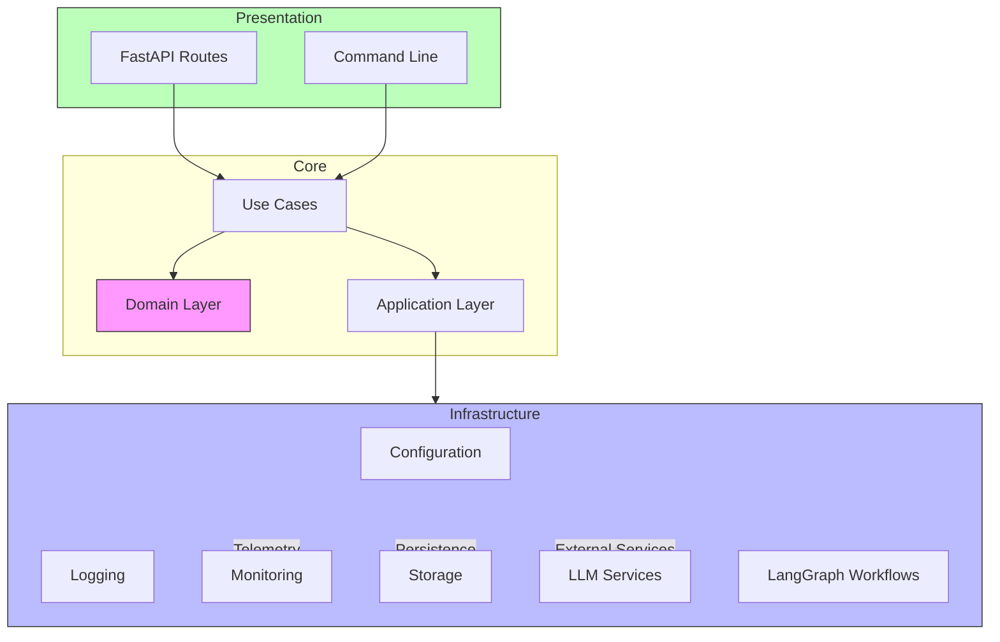

# MCPAgent Architecture

## Project Structure
```
src/mcpagent/
├── core/                      # Core domain and business logic
│   ├── application/          # Application services and use cases
│   │   ├── commands/        # Command handlers
│   │   ├── dto/            # Data Transfer Objects
│   │   ├── queries/        # Query handlers
│   │   └── use_cases/      # Business use cases
│   ├── domain/              # Domain model
│   │   ├── entities/       # Domain entities
│   │   ├── interfaces/     # Abstract interfaces
│   │   └── value_objects/  # Value objects
│   └── exceptions/          # Domain exceptions
├── infrastructure/           # External implementations and tools
│   ├── agents/             # Agent implementations
│   ├── config/             # Configuration management
│   ├── llm/               # LLM service implementations
│   ├── logger/            # Logging infrastructure
│   ├── monitoring/        # Monitoring tools (Grafana, Langfuse)
│   ├── prompts/           # Prompt management
│   ├── storage/           # Storage implementations
│   ├── tools/             # Tool implementations
│   └── workflows/         # LangGraph workflow implementations
└── presentation/            # User interface layer
    ├── api/               # FastAPI implementation
    └── cli/               # Command Line Interface
```

## Architecture Overview

The MCPAgent follows a Clean Architecture pattern with four main layers:

1. **Core Layer** (Domain & Application)
   - Contains business logic and rules
   - Defines interfaces and entities
   - Independent of external frameworks

2. **Infrastructure Layer**
   - Implements interfaces defined in core
   - Handles external services and tools
   - Manages technical concerns

3. **Presentation Layer**
   - Provides API and CLI interfaces
   - Handles HTTP routes and controllers
   - Manages user interaction

4. **Workflows Layer**
   - Implements LangGraph-based workflows
   - Orchestrates agent interactions
   - Manages state and transitions

## Component Interaction



## Key Components

### Domain Layer
- Defines core business entities (Agent, Context, LLM, Message, etc.)
- Contains business rules and logic
- Provides interfaces for infrastructure implementations

### Infrastructure Layer
- Implements external service integrations
- Manages configuration and logging
- Handles storage and monitoring
- Implements LangGraph workflow orchestration

### Presentation Layer
- FastAPI implementation for HTTP endpoints
- CLI interface for command-line interactions
- Error handling and middleware

### Workflow Components
- LangGraph-based workflow orchestration
- React pattern implementation
- State management and transitions