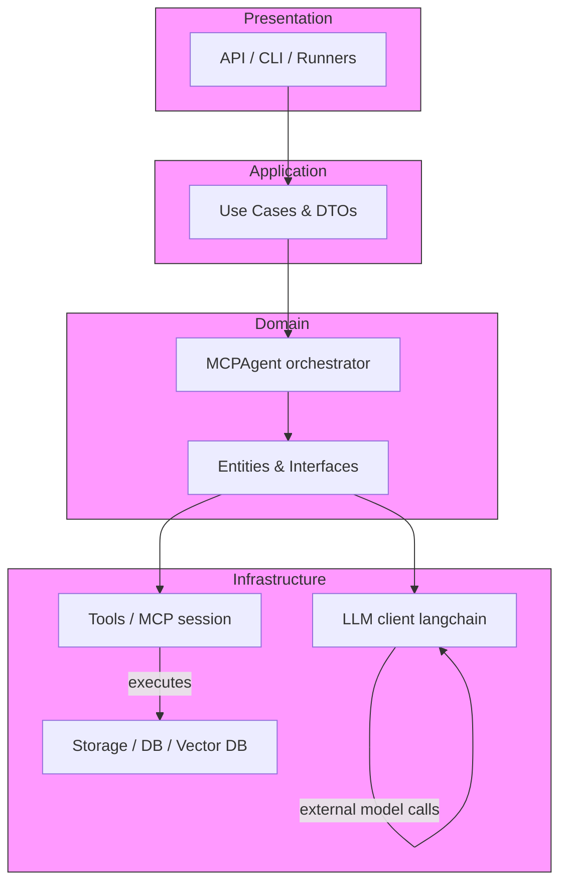
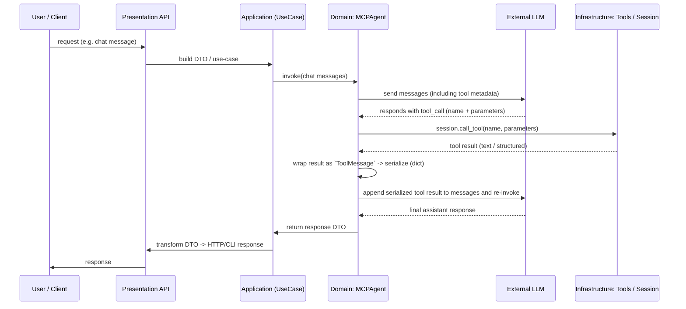
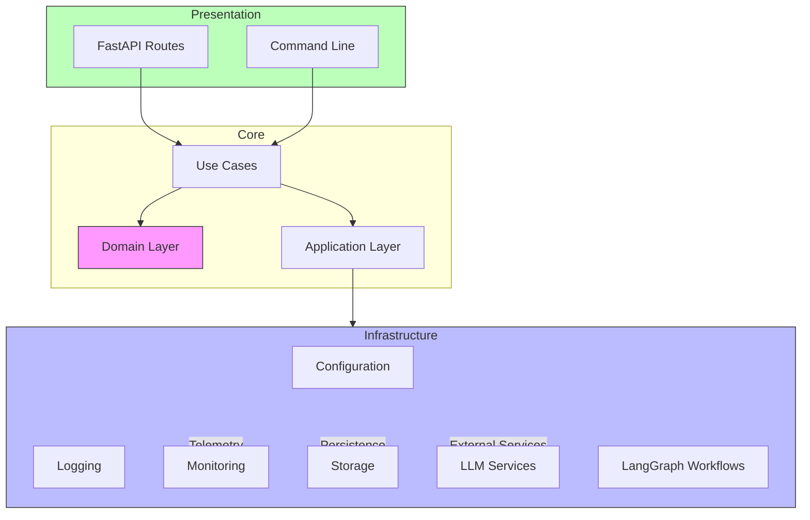

# MCPAgent Architecture
# Architecture overview

This document describes the high-level layering used in this repository and a short example showing how an MCP-style tool call flows through the layers (LLM -> mcpagent -> tool -> result -> LLM).

## Layers

```
Presentation
    └─ Application
            └─ Domain
                    └─ Infrastructure
```

- Presentation (mcpagent.presentation)
    - HTTP / CLI entrypoints, routes, middleware and runners.
    - Example files: `presentation/api/app.py`, `presentation/api/run.py`, `presentation/langgraph/main.py`.

- Application (mcpagent.core.application)
    - Use-cases, commands, DTOs and orchestration glue. Translates external requests into domain intent.
    - Example files: `application/use_cases/chat_agent_use_case.py`, `application/dto/*`.

- Domain (mcpagent.core.domain)
    - Core business logic, entities, value objects and interfaces. Contains `Agent`, `ChatLLM`, `Tool`, `MCPAgent` orchestrator.
    - Example files: `domain/entities/agent.py`, `domain/entities/llm.py`, `domain/entities/mcp_agent.py`, `domain/entities/tool.py`.

- Infrastructure (mcpagent.infrastructure)
    - Concrete adapters and platform code: LLM client initialization, tool implementations, storage, logging, monitoring, and MCP session adapters.
    - Example folders: `infrastructure/llm`, `infrastructure/tools`, `infrastructure/logger`, `infrastructure/storage`.

## Visual: Layer structure



## Example: MCP tool call flow (sequence)

This shows the typical interaction when the LLM requests a tool call and the agent runs the tool and returns the result.



Notes on boundaries:
- The Domain layer owns the agent orchestration logic. It should not assume transport details (HTTP) nor concrete LLM instantiation.
- The Application layer maps transport-level DTOs to domain calls and back.
- The Infrastructure layer provides concrete implementations: LLM adapter, tool sessions, persistence and logging.

## Where things live in this repo (examples)
- Presentation: `mcpagent/src/mcpagent/presentation/api/*` and `presentation/langgraph/*`
- Application / DTOs: `mcpagent/src/mcpagent/core/application/*` (use_cases, dto, commands)
- Domain entities: `mcpagent/src/mcpagent/core/domain/entities/*` (agent.py, llm.py, mcp_agent.py, tool.py)
- Infrastructure adapters: `mcpagent/src/mcpagent/infrastructure/*` (llm, tools, logger, storage)
- Tests: `mcpagent/tests/*` (unit and integration tests exercise the layers)

## Example mapping (quick)
- LLM call: `domain.entities.llm.ChatLLM` -> uses infrastructure LLM adapter to talk to a model.
- Tool orchestration: `domain.entities.mcp_agent.MCPAgent` -> receives tool_call from LLM, executes via `infrastructure.tools` (session), wraps result in `application.dto.tool_message.ToolMessage` and serializes before sending back to LLM.

---

If you'd like, I can also:
- generate a PNG/SVG export of the mermaid diagrams and add it to `docs/`;
- or expand the sequence diagram to show error paths (tool failure, timeouts) and retry logic.

## Project Structure
```
src/mcpagent/
├── core/                      # Core domain and business logic
│   ├── application/          # Application services and use cases
│   │   ├── commands/        # Command handlers
│   │   ├── dto/            # Data Transfer Objects
│   │   ├── queries/        # Query handlers
│   │   └── use_cases/      # Business use cases
│   ├── domain/              # Domain model
│   │   ├── entities/       # Domain entities
│   │   ├── interfaces/     # Abstract interfaces
│   │   └── value_objects/  # Value objects
│   └── exceptions/          # Domain exceptions
├── infrastructure/           # External implementations and tools
│   ├── agents/             # Agent implementations
│   ├── config/             # Configuration management
│   ├── llm/               # LLM service implementations
│   ├── logger/            # Logging infrastructure
│   ├── monitoring/        # Monitoring tools (Grafana, Langfuse)
│   ├── prompts/           # Prompt management
│   ├── storage/           # Storage implementations
│   ├── tools/             # Tool implementations
│   └── workflows/         # LangGraph workflow implementations
└── presentation/            # User interface layer
    ├── api/               # FastAPI implementation
    └── cli/               # Command Line Interface
```

## Architecture Overview

The MCPAgent follows a Clean Architecture pattern with four main layers:

1. **Core Layer** (Domain & Application)
   - Contains business logic and rules
   - Defines interfaces and entities
   - Independent of external frameworks

2. **Infrastructure Layer**
   - Implements interfaces defined in core
   - Handles external services and tools
   - Manages technical concerns

3. **Presentation Layer**
   - Provides API and CLI interfaces
   - Handles HTTP routes and controllers
   - Manages user interaction

4. **Workflows Layer**
   - Implements LangGraph-based workflows
   - Orchestrates agent interactions
   - Manages state and transitions

## Component Interaction



## Key Components

### Domain Layer
- Defines core business entities (Agent, Context, LLM, Message, etc.)
- Contains business rules and logic
- Provides interfaces for infrastructure implementations

### Infrastructure Layer
- Implements external service integrations
- Manages configuration and logging
- Handles storage and monitoring
- Implements LangGraph workflow orchestration

### Presentation Layer
- FastAPI implementation for HTTP endpoints
- CLI interface for command-line interactions
- Error handling and middleware

### Workflow Components
- LangGraph-based workflow orchestration
- React pattern implementation
- State management and transitions