# MCP (Model Control Protocol) System

This document explains how the MCP system works, including its components, interactions, and data flow.

## System Overview

The MCP system enables communication between clients and model servers through various transport protocols. Here's a high-level view of the system:

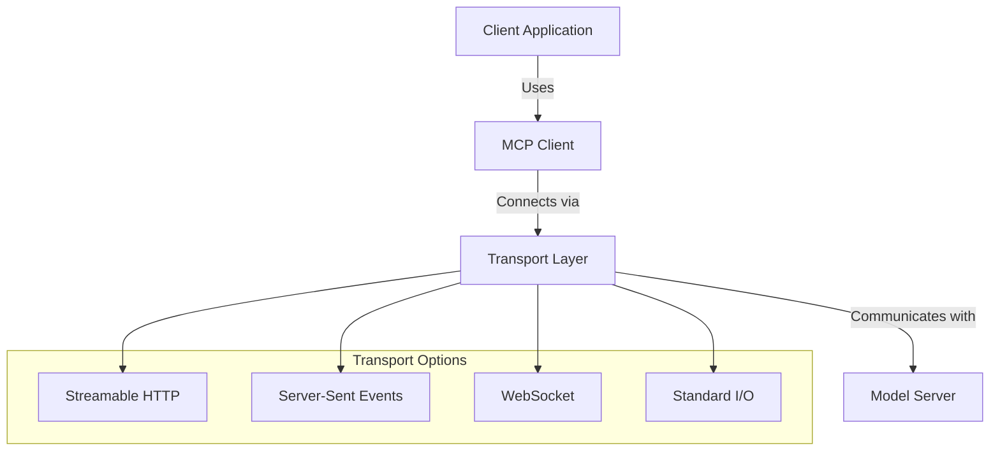

## Connection Flow

The connection process follows these steps:

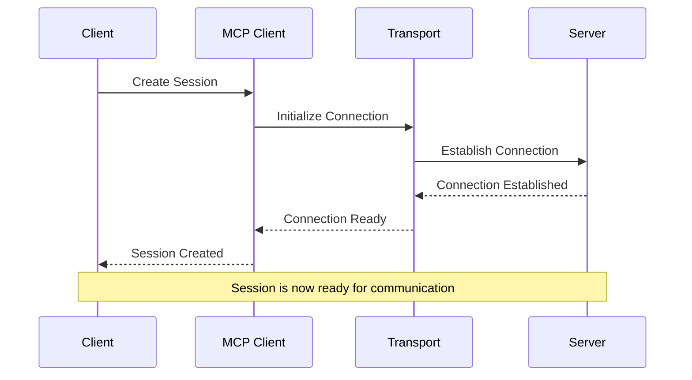

## Session Management

Sessions are managed through a factory pattern:

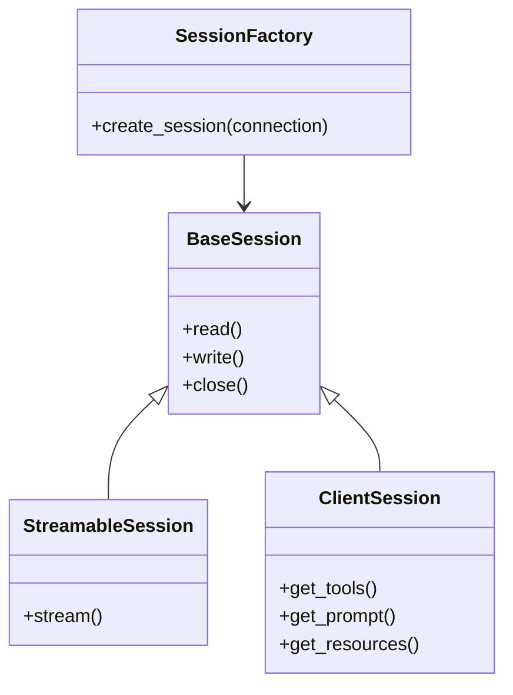

## Transport Layer Details

### Streamable HTTP

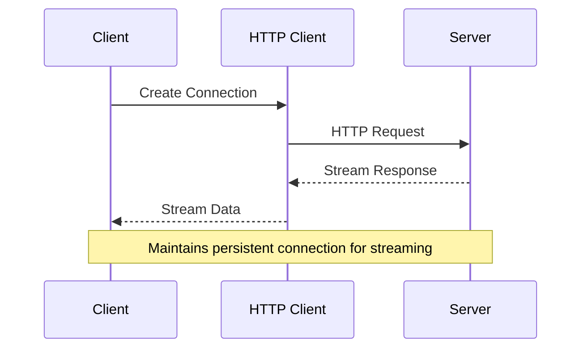

### Server-Sent Events (SSE)

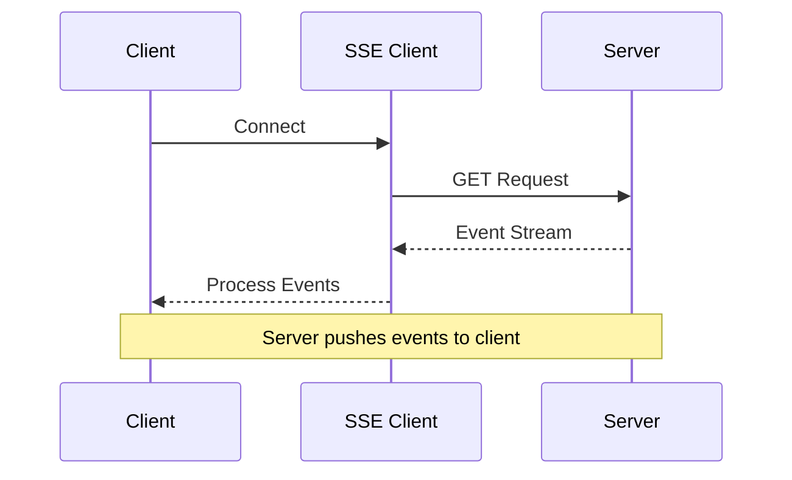

### WebSocket

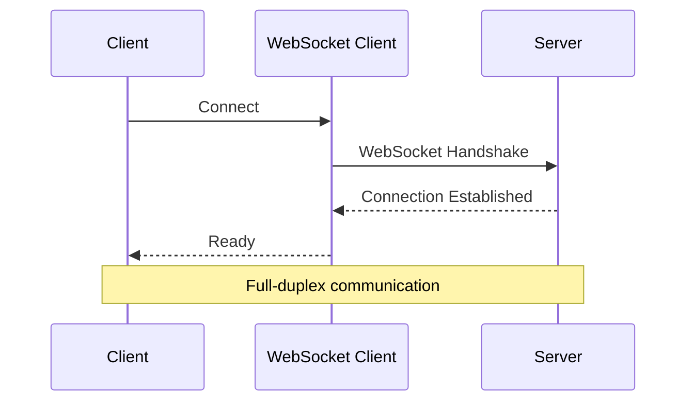

### Standard I/O

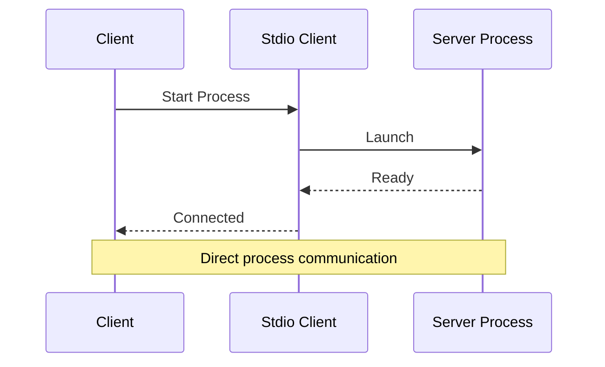

## Error Handling

The system implements comprehensive error handling:

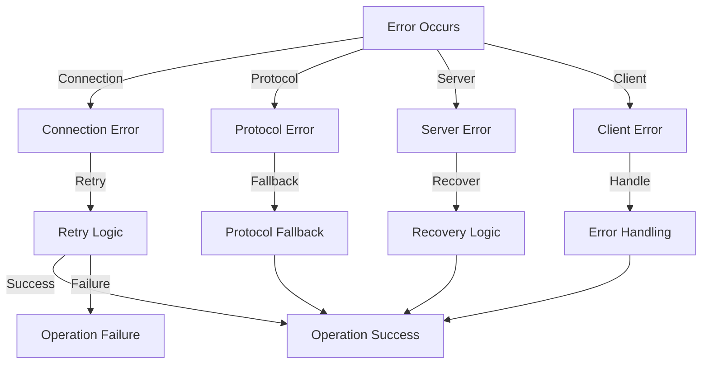

## Resource Management

Resources are managed through a lifecycle:

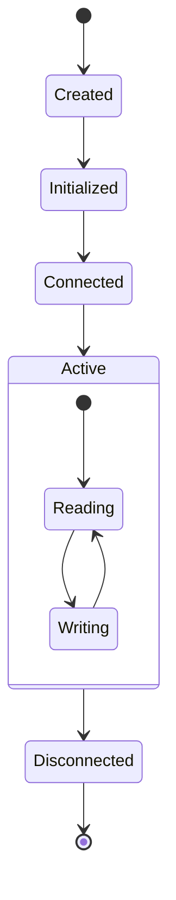

## Configuration Flow

The configuration process:

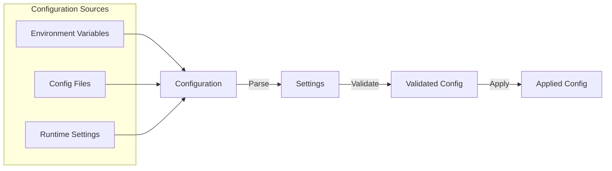

## Testing Strategy

The testing approach covers multiple levels:

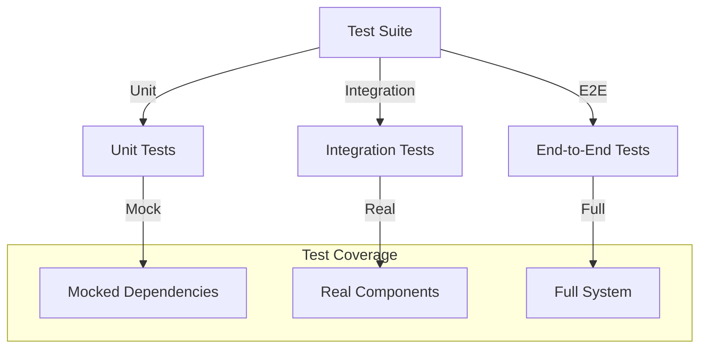

## Future Improvements

1. **Enhanced Error Recovery**
   - Implement automatic retry mechanisms
   - Add circuit breaker patterns
   - Improve error reporting

2. **Performance Optimization**
   - Add connection pooling
   - Implement caching strategies
   - Optimize resource usage

3. **Monitoring and Observability**
   - Add metrics collection
   - Implement tracing
   - Enhance logging

4. **Security Enhancements**
   - Add authentication mechanisms
   - Implement encryption
   - Add rate limiting

5. **Protocol Extensions**
   - Support additional transport protocols
   - Add protocol versioning
   - Implement protocol negotiation 